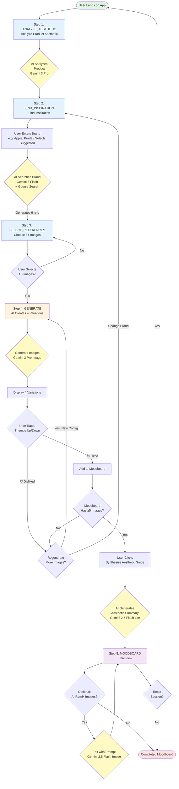

# AestheticAI Moodboard Builder - User Flow Documentation

## Overview
**Application Type**: React-based Single Page Application (SPA)
**Tech Stack**: React 19, TypeScript, Vite, Tailwind CSS, Google Gemini AI
**Purpose**: AI-powered brand moodboard generation tool
**Estimated Time**: 5-15 minutes per moodboard

---

## Complete User Journey Flowchart



---

## Linear Step Progression

```
┌─────────────────────────────────────────────────────────────────────────┐
│                         USER FLOW PROGRESSION                            │
└─────────────────────────────────────────────────────────────────────────┘

    ┌─────────────────┐
    │     STEP 1      │
    │ ANALYZE AESTHETIC │  → Analyze product image
    │                 │  → Get aesthetic analysis
    │                 │  → Receive brand suggestions
    └───────┬─────────┘
            │ (manual: click "Find Inspiration")
            ▼
    ┌─────────────────┐
    │     STEP 2      │
    │ FIND INSPIRATION │  → Explore suggested brands
    │                 │  → Search for new brands
    └───────┬─────────┘
            │ (manual: click "Search")
           ▼
    ┌──────────────┐
    │   STEP 3     │
    │   SELECT     │  → Choose 5+ reference images
    │  REFERENCES  │  → Define aesthetic direction
    └──────┬───────┘
           │ (manual: click "Generate Synthesis")
           ▼
    ┌──────────────┐
    │   STEP 4     │
    │  GENERATE    │  → AI creates 4 variations
    │              │  → Rate images (👍/👎)
    │              │  → Build moodboard (min 5)
    │              │  → Configure & regenerate
    └──────┬───────┘
           │ (manual: click "Synthesize Aesthetic Guide")
           ▼
    ┌──────────────┐
    │   STEP 5     │
    │  MOODBOARD   │  → View final moodboard
    │              │  → Read aesthetic guide
    │              │  → Optional: AI remix images
    └──────────────┘
```

---

## Detailed Step Breakdown

### Step 1: ANALYZE_AESTHETIC
**File**: `src/components/UploadStep.tsx`

**User Actions**:
- Drag-drop or click to upload product image
- Click "Use Sample Product"
- Review "Your Aesthetic Anchor" (product image + analysis)
- Click "Find Inspiration" button to proceed

**System Actions**:
- AI analyzes product image using `analyzeProductImage()` (Gemini 3 Pro)
- Extracts: key design features, primary material cues, aesthetic analysis
- Automatically fetches initial brand suggestions (parsed from analysis or via backup Gemini call)

**Exit Condition**: Manual click on "Find Inspiration" button

---

### Step 2: FIND_INSPIRATION
**File**: `src/components/FindInspirationStep.tsx`

**Layout**:
- Brand search interface with suggested brands (from product analysis or backup)

**User Actions**:
- Select a suggested brand button
- OR Enter brand name (e.g., "Apple", "Prada", "Rimowa")
- Click "Search" button

**System Actions**:
- AI searches brand using `searchBrandReferences()` (Gemini 3 Flash + Google Search)
- Generates 6 reference image placeholders
- Analyzes brand's visual identity

**Exit Condition**: Manual click on "Search"

---

### Step 3: SELECT_REFERENCES
**File**: `src/components/ReferenceSelectionStep.tsx`

**Layout**:
- Grid of 6 brand reference images
- Selection counter (X/5)

**User Actions**:
- Click images to select/deselect
- Must select minimum 5 images
- Click "Generate Synthesis" when ready

**Visual Feedback**:
- Selected images: blue ring + checkmark
- Button disabled until 5+ selected

**Exit Condition**: Manual click on "Generate Synthesis" (requires ≥5 selections)

---

### Step 4: GENERATE (Iterative Phase)
**File**: `src/components/GenerateStep.tsx`

**Layout**:
- Sidebar: Configuration panel + moodboard preview
- Main area: 4 generated image variations

**User Actions**:
- Rate images with 👍 (like) or 👎 (dislike)
- Configure aspect ratio (1:1, 16:9, 9:16, 4:3)
- Configure resolution (1K, 2K, 4K)
- Click "Regenerate" for new batch
- Click "Change References" to go back
- Click "Synthesize Guide" when moodboard complete

**System Actions**:
- Generates 4 variations using `generateProImage()` (Gemini 3 Pro Image)
- 👍 automatically adds image to moodboard
- Tracks moodboard count (minimum 5 required)
- Shows progress bar

**Exit Condition**: Manual click on "Synthesize Guide" (requires ≥5 moodboard images)

---

### Step 5: MOODBOARD (Final View)
**File**: `src/components/MoodboardStep.tsx`

**Layout**:
- Sidebar: Configuration + full moodboard collection
- Main area: Aesthetic Guide summary

**User Actions**:
- Review final moodboard
- Read AI-generated aesthetic summary
- Optional: Hover over images → "AI Remix" button
- Optional: Enter text prompt to edit images
- Optional: Click "Reset Session" to start over

**System Actions**:
- Generates aesthetic summary using `generateAestheticSummary()` (Gemini 2.5 Flash Lite)
- Optional: Edits images using `editImageWithPrompt()` (Gemini 2.5 Flash Image)

**Exit Condition**: None (end state) or Reset Session

---

## Navigation Map

```
┌─────────────────────────────────────────────────────────────────┐
│                      NAVIGATION PATTERNS                         │
└─────────────────────────────────────────────────────────────────┘

PRIMARY FLOW (One-Way):
ANALYZE_AESTHETIC → FIND_INSPIRATION → SELECT_REFERENCES → GENERATE → MOODBOARD

BACKWARD NAVIGATION:
┌─────────────────────────────────────────────────────────────────┐
│ • "Change References" (from GENERATE → SELECT_REFERENCES)       │
│ • "Reset Session" (from any step → ANALYZE_AESTHETIC)           │
│ • NO traditional back button                                     │
│ • NO URL-based routing                                          │
└─────────────────────────────────────────────────────────────────┘
```

---

## Key User Interactions

### Interaction Types

| Interaction | Description | Location |
|-------------|-------------|----------|
| **File Upload** | Drag-drop or click to upload | ANALYZE_AESTHETIC step |
| **Text Input** | Enter brand name | FIND_INSPIRATION step |
| **Image Selection** | Click to toggle (multi-select) | SELECT_REFERENCES step |
| **Rating** | Thumbs up/down buttons | GENERATE step |
| **Configuration** | Toggle aspect ratio/resolution | GENERATE step |
| **Regeneration** | Create new batch of variations | GENERATE step |
| **Remix** | Text prompt to edit images | MOODBOARD step |
| **Reset** | Restart entire flow | Any step after UPLOAD |

---

## AI Integration Architecture

```
┌────────────────────────────────────────────────────────────────┐
│                    AI MODELS USED (5 Total)                    │
└────────────────────────────────────────────────────────────────┘

Step 1: ANALYZE_AESTHETIC
├─→ analyzeProductImage()
│   └─→ Gemini 3 Pro (gemini-exp-1206)
│       └─→ Extracts design features, materials, brand compatibility
├─→ getBackupBrandSuggestions() (if parsing fails)
│   └─→ Gemini 3 Flash (or similar)
│       └─→ Suggests brands based on analysis

Step 2: FIND_INSPIRATION
├─→ searchBrandReferences()
│   └─→ Gemini 3 Flash (gemini-2.0-flash-exp)
│       └─→ Google Search integration
│       └─→ Analyzes brand visual identity

Step 4: GENERATE
├─→ generateProImage()
│   └─→ Gemini 3 Pro Image (gemini-exp-1206)
│       └─→ Generates 4 variations per batch
│       └─→ Combines product + brand aesthetic

Step 5: MOODBOARD (Aesthetic Guide)
├─→ generateAestheticSummary()
│   └─→ Gemini 2.5 Flash Lite (gemini-2.5-flash-lite-002)
│       └─→ Creates 3-sentence aesthetic summary

Step 5: MOODBOARD (Remix)
└─→ editImageWithPrompt()
    └─→ Gemini 2.5 Flash Image (gemini-2.5-flash-image)
        └─→ Edits individual moodboard images
```

**API Integration**: `src/services/gemini.ts`

---

## State Management

```
┌────────────────────────────────────────────────────────────────┐
│                    APPLICATION STATE                           │
└────────────────────────────────────────────────────────────────┘

Main App State (src/App.tsx):
├─ currentStep: AppStep
├─ productImage: File | null
├─ productAnalysis: string
├─ brandName: string
├─ brandDescription: string
├─ referenceImages: string[]
├─ selectedReferences: number[]
├─ generatedImages: GeneratedImage[]
├─ moodboard: GeneratedImage[]
├─ aestheticSummary: string
├─ aspectRatio: AspectRatio
├─ resolution: Resolution
└─ isLoading: boolean

State Flow:
User Action → Update State → Re-render → System Action (if needed)
```

**No external state management** (Redux, Zustand, etc.)
**No routing library** (React Router)
All state managed via React useState hooks

---

## Loading States

```
┌────────────────────────────────────────────────────────────────┐
│                    LOADING EXPERIENCE                          │
└────────────────────────────────────────────────────────────────┘

When AI is processing:
├─ Full-screen overlay
├─ Message: "Gemini is Synthesizing Vision..."
├─ Blocks all user interaction
└─ Disappears when operation completes

AI Operations that trigger loading:
├─ Product analysis (ANALYZE_AESTHETIC)
├─ Brand search (FIND_INSPIRATION → SELECT_REFERENCES)
├─ Image generation (GENERATE step)
├─ Aesthetic guide creation (GENERATE → MOODBOARD)
└─ Image remix (MOODBOARD step)
```

---

## User Journey Milestones

```
┌────────────────────────────────────────────────────────────────┐
│                 COMPLETION REQUIREMENTS                        │
└────────────────────────────────────────────────────────────────┘

Minimum Requirements to Progress:
├─ ANALYZE_AESTHETIC: Product uploaded + analyzed ✓
├─ FIND_INSPIRATION → SELECT_REFERENCES: Brand searched ✓
├─ SELECT_REFERENCES → GENERATE: 5+ images selected ✓
├─ GENERATE → MOODBOARD: 5+ images in moodboard ✓
└─ MOODBOARD: Aesthetic guide generated ✓

Optional Actions:
├─ Regenerate images (unlimited)
├─ Change aspect ratio/resolution (unlimited)
├─ Change reference images (back navigation)
└─ Remix moodboard images (unlimited)
```

---

## Technical File Structure

```
src/
├── App.tsx                          # Main app logic & state
├── components/
│   ├── UploadStep.tsx              # Step 1: Analyze Aesthetic interface
│   ├── FindInspirationStep.tsx     # Step 2: Find Inspiration
│   ├── ReferenceSelectionStep.tsx  # Step 3: Image selection
│   ├── GenerateStep.tsx            # Step 4: Generation & rating
│   └── MoodboardStep.tsx           # Step 5: Final view
├── services/
│   └── gemini.ts                   # All AI API integrations
└── types/
    └── index.ts                    # TypeScript type definitions

Key Types:
├─ AppStep: enum (ANALYZE_AESTHETIC | FIND_INSPIRATION | SELECT_REFERENCES | GENERATE | MOODBOARD)
├─ AspectRatio: "1:1" | "16:9" | "9:16" | "4:3"
├─ Resolution: "1K" | "2K" | "4K"
└─ GeneratedImage: { url, liked, config }
```

---

## Design Philosophy

**Core Principles**:
1. **Linear & Guided**: Minimizes user confusion with clear progression
2. **AI-Augmented**: AI handles technical complexity at each step
3. **Iterative Refinement**: Users curate through rating and regeneration
4. **Minimum Viable Output**: Quality threshold (5 images minimum)
5. **Low Friction**: Automatic transitions where possible

**User Role**: Creative Director
**AI Role**: Designer & Researcher

The application is a **collaborative creative tool** where users provide strategic direction (product selection, brand target, aesthetic curation) while AI executes the tactical work (analysis, research, generation, editing).

---

## Estimated Time Investment

| Phase | Time | User Effort |
|-------|------|-------------|
| ANALYZE_AESTHETIC | 30 sec | Low (analyze aesthetic) |
| FIND_INSPIRATION | 1 min | Low (explore/search brands) |
| SELECT_REFERENCES | 1 min | Medium (5+ selections) |
| GENERATE | 5-10 min | High (iterative curation) |
| MOODBOARD | 1-3 min | Low (review + optional remix) |
| **Total** | **5-15 min** | **Mostly in generation phase** |

---

## Future Enhancement Opportunities

Potential UX improvements based on flow analysis:
- Save/export functionality for moodboards
- History feature to revisit previous moodboards
- Undo/redo for selections and ratings
- Batch operations (like/unlike multiple images)
- Keyboard shortcuts for power users
- Share/collaborate features
- Template library of popular brand aesthetics

---

**Last Updated**: 2026-01-11
**Documentation**: This file provides the complete user flow for the AestheticAI Moodboard Builder application.
